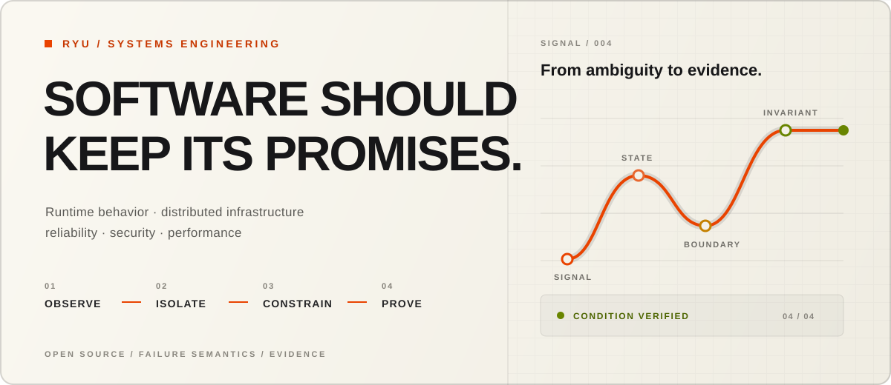

<picture>
  <source media="(prefers-color-scheme: dark)" srcset="./assets/profile-dark.svg">
  <source media="(prefers-color-scheme: light)" srcset="./assets/profile-light.svg">
  
</picture>

  <a href="#selected-casework"><strong>SELECTED WORK</strong></a>
  &nbsp;&nbsp;·&nbsp;&nbsp;
  <a href="https://github.com/search?q=is%3Apr+author%3Aryux1&type=pullrequests"><strong>ALL PULL REQUESTS</strong></a>
  &nbsp;&nbsp;·&nbsp;&nbsp;
  <a href="https://github.com/ryux1?tab=repositories"><strong>REPOSITORIES</strong></a>

<table>
  <tr>
    <td width="62%" valign="top">
      <h2>Engineering past the happy path.</h2>
      I work on systems where correctness depends on the behavior people usually
      skip: compatibility boundaries, concurrency, resource accounting,
      authorization, failure recovery, and the exact promise an interface makes.
        
      My public work is primarily upstream engineering. I reproduce the condition,
      locate the violated invariant, make the narrowest defensible change, and
      leave behind evidence that explains why it is correct.
    </td>
    <td width="38%" valign="top">
      <h3>OPERATING RANGE</h3>
      <code>runtime semantics</code>  
      <code>distributed systems</code>  
      <code>reliability + recovery</code>  
      <code>security boundaries</code>  
      <code>performance evidence</code>
    </td>
  </tr>
</table>

## Built work

### [MCP Trace](https://github.com/ryux1/mcp-trace)

A security-first observability gateway for Model Context Protocol traffic. It traces, measures,
records, inspects, and safely replays Streamable HTTP without taking over authentication or server
routing. The public preview includes a runnable container, offline HTML reports, Prometheus metrics,
OpenTelemetry export, a deterministic demo, and explicit compatibility and security boundaries.

[SOURCE](https://github.com/ryux1/mcp-trace) ·
[DOCUMENTATION](https://ryux1.github.io/mcp-trace/) · `PUBLIC PREVIEW`

## Selected casework

<table>
  <tr>
    <td width="50%" valign="top">
      01 / APACHE DATAFUSION · RUST + ARROW  
      <strong><a href="https://github.com/apache/datafusion/pull/24319">Account for memory once.</a></strong>  
      Removed repeated record-batch accounting while preserving correctness for
      view arrays, shared buffers, and zero-copy slices.  
      <code>MERGED</code>
    </td>
    <td width="50%" valign="top">
      02 / SUPABASE REALTIME · ELIXIR  
      <strong><a href="https://github.com/supabase/realtime/pull/2089">Authorize only what will be written.</a></strong>  
      Preserved explicit Broadcast and Presence policy checks without performing
      unrelated extension reads.  
      <code>MERGED</code>
    </td>
  </tr>
  <tr>
    <td width="50%" valign="top">
      03 / NASA F´ · C++  
      <strong><a href="https://github.com/nasa/fprime/pull/5670">Make four states one invariant.</a></strong>  
      Centralized parameter-validity semantics across a flight-software framework
      API and its regression coverage.  
      <code>MERGED</code>
    </td>
    <td width="50%" valign="top">
      04 / APACHE HUDI · JAVA + SPARK  
      <strong><a href="https://github.com/apache/hudi/pull/19850">Reject what cannot be represented.</a></strong>  
      Turned unsupported procedure filter functions into explicit validation
      failures with focused tests.  
      <code>MERGED</code>
    </td>
  </tr>
</table>

  More merged work in
  <a href="https://github.com/pysnmp/pyasn1/pull/173">pyasn1</a> ·
  <a href="https://github.com/apache/sedona/pull/3326">Apache Sedona</a> ·
  <a href="https://github.com/python/typeshed/pulls?q=is%3Apr+author%3Aryux1">typeshed</a> ·
  <a href="https://github.com/aio-libs/aiohttp/pulls?q=is%3Apr+author%3Aryux1">aiohttp</a> ·
  <a href="https://github.com/getsentry/sentry-cli/pulls?q=is%3Apr+author%3Aryux1">Sentry CLI</a>

## The work

<table>
  <tr>
    <td width="50%" valign="top">
      <strong>RUNTIME</strong>  
      Linux behavior, filesystems, memory, native interfaces, and compatibility.
    </td>
    <td width="50%" valign="top">
      <strong>DISTRIBUTED</strong>  
      Networks, services, authorization, coordination, and partial failure.
    </td>
  </tr>
  <tr>
    <td width="50%" valign="top">
      <strong>ASSURANCE</strong>  
      Explicit policy, provenance, diagnostics, and deterministic verification.
    </td>
    <td width="50%" valign="top">
      <strong>PERFORMANCE</strong>  
      Measurement, hot paths, resource models, and optimization without semantic drift.
    </td>
  </tr>
</table>

  <code>Rust</code>&nbsp;&nbsp;
  <code>C++</code>&nbsp;&nbsp;
  <code>Go</code>&nbsp;&nbsp;
  <code>Elixir</code>&nbsp;&nbsp;
  <code>Python</code>&nbsp;&nbsp;
  <code>Java</code>&nbsp;&nbsp;
  <code>TypeScript</code>

---

  <strong>Observe the behavior. Find the boundary. Change the minimum. Prove the result.</strong>

