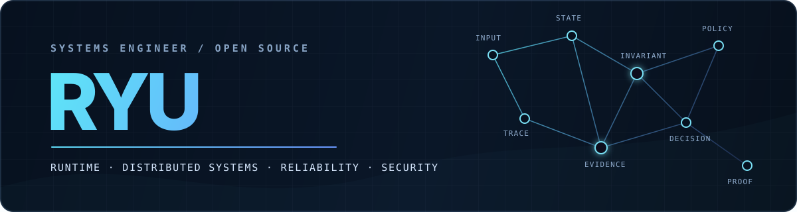

<p align="center">
  
</p>

<p align="center">
  <a href="https://github.com/ryux1/mcp-trace"><strong>MCP Trace</strong></a>
  &nbsp;·&nbsp;
  <a href="https://github.com/search?q=is%3Apr+author%3Aryux1&type=pullrequests"><strong>Open-source work</strong></a>
  &nbsp;·&nbsp;
  <a href="https://github.com/ryux1?tab=repositories"><strong>Repositories</strong></a>
</p>

## I build where failure gets interesting.

I am a systems engineer focused on runtime behavior, distributed infrastructure,
reliability, security, and the boundaries where software stops behaving like its
happy-path design.

My work turns ambiguous behavior into explicit invariants, narrow changes, and
tests that prove the failure mode is gone. The public evidence ranges from Linux
device semantics and Arrow memory accounting to realtime authorization and
flight-software APIs.

<table>
  <tr>
    <td width="50%" valign="top">
      <h3>01 / Systems</h3>
      Linux behavior, runtimes, filesystems, memory, concurrency, and the
      compatibility contracts beneath application code.
    </td>
    <td width="50%" valign="top">
      <h3>02 / Distributed</h3>
      Networks, realtime systems, service boundaries, failure recovery, and
      operational behavior under partial failure.
    </td>
  </tr>
  <tr>
    <td width="50%" valign="top">
      <h3>03 / Assurance</h3>
      Security boundaries, deterministic verification, provenance, policy, and
      diagnostics that distinguish evidence from assumption.
    </td>
    <td width="50%" valign="top">
      <h3>04 / Performance</h3>
      Resource accounting, measurement, hot-path analysis, and optimizations
      that preserve correctness instead of merely moving cost around.
    </td>
  </tr>
</table>

## Built here

### [MCP Trace](https://github.com/ryux1/mcp-trace)

A security-first observability gateway for the Model Context Protocol over
Streamable HTTP.

```text
MCP client  ─────▶  MCP Trace  ─────▶  upstream server
                       │
                       ├─ Prometheus metrics
                       ├─ OpenTelemetry traces
                       └─ sanitized recording + controlled replay
```

It provides transparent JSON/SSE proxying, MCP-aware inspection, W3C trace
propagation, metadata-safe recording defaults, credential redaction, dry-run-first
replay, and explicit execution limits without taking protocol authority from the
upstream server.

[Project site](https://ryux1.github.io/mcp-trace/)
· [Architecture](https://github.com/ryux1/mcp-trace/blob/main/docs/architecture.md)
· [Security model](https://github.com/ryux1/mcp-trace/blob/main/docs/security.md)
· [Deterministic demo](https://github.com/ryux1/mcp-trace#start-in-30-seconds)

## Open source, in practice

These are selected changes where the patch required judgment about behavior—not
just syntax or dependency churn.

| Project | Change | What the work established |
| --- | --- | --- |
| **Supabase Realtime** | [Lazy extension write-policy checks](https://github.com/supabase/realtime/pull/2089) · merged | Preserved explicit Broadcast and Presence authorization while avoiding unrelated extension reads. |
| **Apache DataFusion** | [Reduce record-batch memory accounting overhead](https://github.com/apache/datafusion/pull/24319) · merged | Removed repeated Arrow accounting work without losing view-array or shared-buffer correctness. |
| **NASA F´** | [Add a parameter validation macro](https://github.com/nasa/fprime/pull/5670) · merged | Centralized four-state parameter-validity semantics across the C++ framework API and its tests. |
| **Apache Hudi** | [Reject unsupported procedure filter functions](https://github.com/apache/hudi/pull/19850) · merged | Turned invalid Spark procedure filters into explicit validation failures with focused coverage. |
| **Google gVisor** | [Return `ESPIPE` for positional PTY I/O](https://github.com/google/gvisor/pull/14097) · approved | Matched Linux VFS/devpts behavior with syscall and filesystem regression coverage. |

The broader contribution surface includes
[aiohttp](https://github.com/aio-libs/aiohttp),
[typeshed](https://github.com/python/typeshed),
[Click](https://github.com/pallets/click),
[Apache Sedona](https://github.com/apache/sedona),
[Sentry CLI](https://github.com/getsentry/sentry-cli), and other projects across
Rust, Go, C++, Elixir, Python, Java, and TypeScript.

[See every pull request →](https://github.com/search?q=is%3Apr+author%3Aryux1&type=pullrequests)

## Working method

```text
reproduce  →  isolate  →  model the invariant  →  change narrowly  →  prove it
```

- Correctness includes failure paths, recovery behavior, and compatibility.
- Security, observability, and performance are design constraints.
- A tool result is evidence for the exact claim it can support—nothing broader.
- Good architecture keeps authority explicit and makes invalid states difficult.

<p align="center">
  <sub>Systems should remain understandable when the happy path disappears.</sub>
</p>
